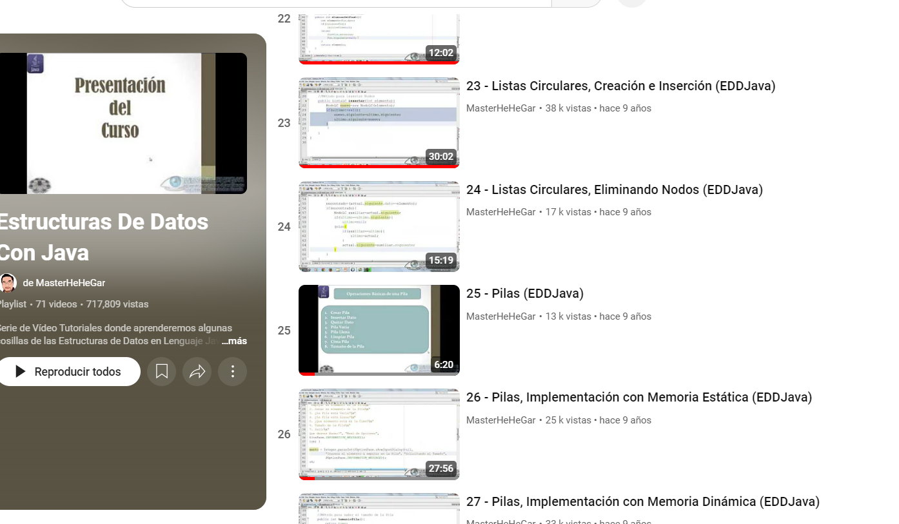
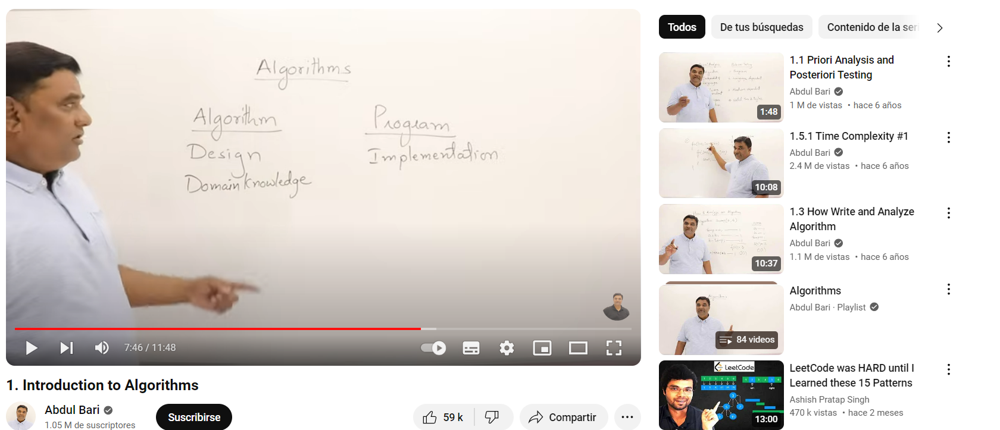
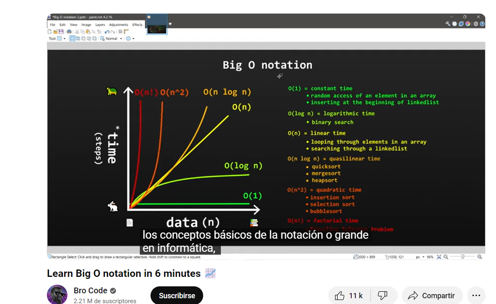

Videos y herramientas interesantes

Curso de estructuras de datos en java
Contiene desde las definiciones de TDA hasta una explicación con dibujos de cada estructura de datos trabajadas en el curso
Listas, Pilas, Colas, Arboles, Grafos, Hashmaps etc
https://www.youtube.com/playlist?list=PLCLpAU8VN0j4RGemFfybZrWoSX57NbEq9

Abdul Bari curso de algoritmos
Que los Indues son buenos en programación y algoritmos no es un mito!
https://www.youtube.com/watch?v=0IAPZzGSbME&t=464s

El mejor video que he visto sobre analisis de tiempos de ejecucion y notacion bigO
https://www.youtube.com/watch?v=XMUe3zFhM5c

